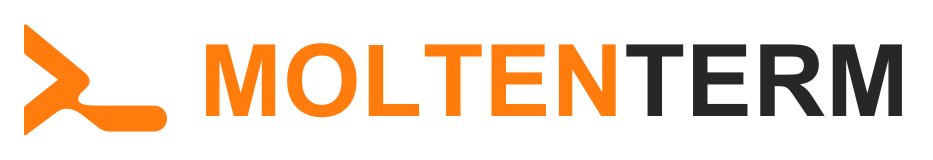

<p align="center">
  <picture>
    <source media="(prefers-color-scheme: dark)" srcset="build/moltenterm/brand/svg/logo-dark.svg" />
    
  </picture>
</p>

<p align="center"><strong>The terminal that takes your shape.</strong></p>

MoltenTerm is an open-source terminal workspace (terminals, a built-in browser, dashboards) that you reshape by talking
to the AI coding agent you already use. Ask your agent for a panel, a layout or a dashboard card: it writes a mod,
MoltenTerm reloads, and the workspace has changed.

- **Bring your own agent.** MoltenTerm ships no model, needs no API key and proxies no tokens. Claude Code, Codex,
  Gemini CLI or any other CLI agent runs in it exactly as in any terminal.
- **Everything is reversible.** Every change is versioned and can be undone; safe mode always boots.
- **Open by design.** Open source code, an open mod format, and versions of MoltenTerm you can share.

The vision, principles, non-goals and roadmap are in [MANIFESTO.md](MANIFESTO.md).

## Status

Early development. MoltenTerm currently builds on **Wave Terminal v0.14.5** with its own identity, no calls to
services operated by the Wave project, and openly licensed assets. The mod system described in the manifesto is the
next milestone.

## Build from source

Requirements: Go ≥ 1.25.6, [Task](https://taskfile.dev) v3, Node.js 22 with npm 10, and the Xcode Command Line Tools
on macOS.

```bash
task init   # install dependencies
task dev    # run MoltenTerm in development mode
```

[UPSTREAM.md](UPSTREAM.md) documents the full toolchain, the other tasks and how Wave Terminal releases are merged.

## Relationship with Wave Terminal

MoltenTerm is a fork of [Wave Terminal](https://github.com/wavetermdev/waveterm), created by Command Line Inc. and
released under the Apache License 2.0. MoltenTerm keeps Wave's history and merges its releases; every change made to
Wave's files is listed in [UPSTREAM.md](UPSTREAM.md). Many thanks to the Wave Terminal authors.

MoltenTerm is an independent project. It is not affiliated with, sponsored by or endorsed by Command Line Inc. or the
Wave Terminal project.

## Licence

Apache License 2.0 — see [LICENSE](LICENSE) and [NOTICE](NOTICE). MoltenTerm bundles
[Font Awesome Free](https://fontawesome.com) (icons CC BY 4.0, fonts SIL OFL 1.1, code MIT).
